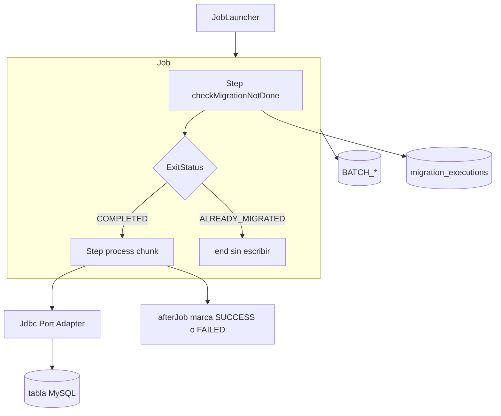
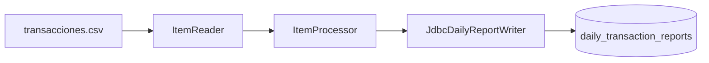
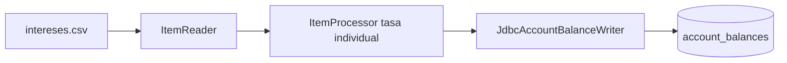
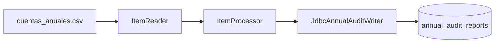

# Jobs de migración

Cada job sigue el patrón Spring Batch chunk-oriented, con un **guard** previo que consulta el ledger `migration_executions` para no reescribir datos ya migrados con éxito.

## Patrón común

## dailyTransactionsJob

| Elemento | Valor |
|---|---|
| CSV | `data/semana_1/transacciones.csv` |
| Guard | `checkDailyMigrationNotDone` |
| Process | `processDailyTransactions` |
| Puerto | `DailyReportWriter` → `JdbcDailyReportWriter` |
| Tabla | `daily_transaction_reports` |

Procesa transacciones, detecta anomalías (monto alto, duplicados) y omite montos no positivos.

## monthlyInterestsJob

| Elemento | Valor |
|---|---|
| CSV | `data/semana_1/intereses.csv` |
| Guard | `checkMonthlyMigrationNotDone` |
| Process | `calculateMonthlyInterests` |
| Puerto | `AccountBalanceWriter` → `JdbcAccountBalanceWriter` |
| Tabla | `account_balances` |

## annualGenerationJob

| Elemento | Valor |
|---|---|
| CSV | `data/semana_1/cuentas_anuales.csv` |
| Guard | `checkAnnualMigrationNotDone` |
| Process | `compileAnnualAudit` |
| Puerto | `AnnualAuditWriter` → `JdbcAnnualAuditWriter` |
| Tabla | `annual_audit_reports` |

El writer consolida por `cuenta_id` vía `AnnualAccountCompiler`.

## Skip / retry

- **Skip:** `DomainError`, `FlatFileParseException` (`skipLimit=100`)
- **Retry:** `TransientDataAccessException` (3 intentos) en writers JDBC
- Processors stateful usan `processorNonTransactional()` y beans `@StepScope`

## Ledger anti-duplicados

Tabla `migration_executions` (`job_name`, `status`, `executed_at`, `write_count`, `skip_count`).

1. Si existe fila `SUCCESS` para el job → exit `ALREADY_MIGRATED` y el job termina sin procesar.
2. Tras un process `COMPLETED` → `markSuccess`.
3. Tras `FAILED` → `markFailed`.

Los jobs usan `RunIdIncrementer`: cada `spring-boot:run` crea una nueva instancia Batch y siempre pasa por el guard (el anti-duplicado es el ledger, no los metadatos Batch).

Para volver a migrar: ejecutar [`scripts/revert-migration.sql`](../scripts/revert-migration.sql). Ver [mysql.md](mysql.md).
